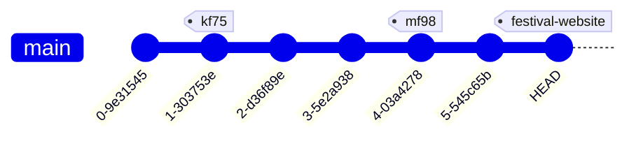

# May Fest / Komaba Fest

This website is built using [Docusaurus 3](https://docusaurus.io/), a modern static website generator.

## 世代管理

第75回駒場祭以降、各学園祭ごとの差分はタグで管理することにします。各学園祭の直前 or 直後に、その学園祭に対応するタグ (例: 第75回駒場祭の場合は `kf75`) を発行してください。

## 開発

### 環境構築

インストールするもの:

- Node.js (for compat)
- Bun: JavaScript Runtime + Package Manager + Test Runner

### 依存のインストール

```sh
bun install --frozen-lockfile
```

(アップデート: `bun update`)

### 開発用サーバー

```
bun watch
```

This command starts a local development server and opens up a browser window. Most changes are reflected live without having to restart the server.

### ビルド

```sh
bun run build
```

This command generates static content into the `build` directory and can be served using any static contents hosting service.

## 運用

Cloudflare の ut.code(); アカウントで管理しています。

<!--
WANT:
- festival.utcode.net は常に最新を指すようにし、 {kf,mf}\d+.utcode.net (e.g. kf75.utcode.net) は各学園祭で固定したい。
- これまでは毎回リポジトリを作り直していたが、これからは同一リポジトリで管理する。
HOW:
1. ブランチを分ける -> 誤って消しそうなので却下。
2. タグをつける ->
  完成するまでタグがつけられないのでそれまで一時的に main を指すようにし、終わったらタグを指すように Cloudflare の設定から変更する必要がある。
  面倒だが、安全ではある。
  -> これにしている。

もっといい案があったら置き換えても良い。
-->

### デプロイ

main ブランチが自動で https://festival.utcode.net に反映されます。
これとは別に、各学園祭ごとに `https://{kf,mf}\d+\.utcode\.net` の形式の URL を発行し、そちらに誘導するようにしてください。

以下は、過去の学園祭のものです。過去のものに触れる必要はありません。
学園祭が終わり次第、その学園祭で発行したタグにデプロイを紐づけて、下に追記してください。

- https://kf75.utcode.net/
- https://mf97.utcode.net/


